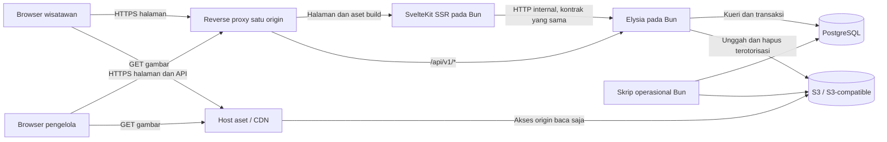

# Design — UMBUL NOGO

> Status: draf tahap 4 — UI/UX dan arsitektur teknis telah disusun.
> Acuan: [requirement.md](./requirement.md). Bagian 1–8 membahas UI/UX; bagian 9–17 membahas arsitektur, data, operasional, dan bukti yang diperlukan saat implementasi.
> Pembaruan 10 September 2026: pusat Pengaturan, Operasional privat, dan pengisian bertahap dirinci pada [settings.md](./settings.md).

## 1. Arah desain

### 1.1 Preferensi pengguna

Pengguna memilih gabungan dua nuansa:

- **Alam yang sejuk:** hijau, krem, dan foto destinasi yang dominan.
- **Air yang segar:** biru, putih, dan elemen visual ringan.

### 1.2 Sintesis yang diusulkan

Hijau menjadi warna identitas dan tindakan utama. Krem memberi latar yang hangat, sementara putih menjaga keterbacaan konten. Biru air digunakan pada tautan lokasi, informasi pendukung, dan bidang aksen yang terbatas. Foto UMBUL NOGO menjadi elemen visual terbesar pada pembuka dan galeri.

Peran warna dibedakan secara konsisten agar perpaduan alam dan air terasa sebagai satu identitas. Nuansa air merupakan preferensi visual; deskripsi fasilitas atau kondisi air tetap mengikuti data pengelola.

### 1.3 Prinsip pengalaman

- **Informasi mudah ditemukan:** akses tiket tersedia sejak bagian pembuka; harga dan ketentuan dibaca bersama.
- **Foto membantu mengenali destinasi:** gambar memperlihatkan tempat dan aktivitas yang benar-benar tersedia.
- **Tampilan sederhana:** ruang kosong cukup, judul singkat, satu tindakan utama pada setiap konteks.
- **Admin mudah dioperasikan:** label menggunakan bahasa pengelola, status tampil terlihat, hasil penyimpanan jelas.
- **Konten inti langsung tersedia:** komposisi halaman mendukung SSR dan tidak menggantungkan keterbacaan pada animasi.

## 2. Struktur informasi dan navigasi

### 2.1 Area publik

MVP menggunakan satu landing page publik pada `/`. Navigasi menuju bagian dalam halaman; fragmen berikut bukan halaman terpisah untuk sitemap.

| Urutan | Bagian | Tujuan | Navigasi/anchor | Kebutuhan |
| --- | --- | --- | --- | --- |
| 1 | Header | Identitas dan akses bagian utama | Tautan merek ke awal halaman | PUB-01 |
| 2 | Pembuka atau hero | Mengenalkan UMBUL NOGO dan mengarahkan kunjungan | `#beranda` | PUB-01 |
| 3 | Daya tarik | Menjelaskan aktivitas atau tempat yang tersedia | `#daya-tarik` | PUB-02 |
| 4 | Tiket masuk | Menampilkan tarif dan ketentuan | `#tiket` | PUB-03 |
| 5 | Fasilitas | Menjelaskan dukungan selama berkunjung | `#fasilitas` | PUB-04 |
| 6 | Galeri | Memperlihatkan suasana destinasi | `#galeri` | PUB-05 |
| 7 | Rencanakan kunjungan | Jadwal, alamat, petunjuk lokasi, dan kontak | `#kunjungan` | PUB-04, PUB-06 |
| 8 | Footer | Identitas ringkas, kontak, serta tautan yang tersedia | Menggunakan tujuan yang sudah ada | PUB-01, PUB-06 |

Tautan pada header: **Daya Tarik**, **Tiket**, **Fasilitas**, **Galeri**, dan **Kunjungan**. Bagian opsional yang kosong beserta tautannya disembunyikan. Bagian Tiket tetap tersedia ketika tarif belum diisi. Menu mobile dapat dibuka dengan kontrol native yang tetap berfungsi sebelum JavaScript aktif.

### 2.2 Area pengelola

| Halaman yang diusulkan | Label antarmuka | Isi utama | Kebutuhan |
| --- | --- | --- | --- |
| `/admin/login` | Masuk Pengelola | Identitas akun, kata sandi, hasil autentikasi | ADM-01 |
| `/admin` | Beranda Pengelola | Pintasan konten dan tautan Lihat Website | ADM-02 |
| `/admin/destinasi` | Informasi Destinasi | Pengantar, gambar utama, lokasi, jadwal, dan kontak | ADM-03 |
| `/admin/daya-tarik` | Daya Tarik | Daftar aktivitas, status, urutan, tambah, ubah, hapus | ADM-04 |
| `/admin/tiket` | Tiket Masuk | Tarif, satuan penerapan, ketentuan, dan status | ADM-05 |
| `/admin/fasilitas` | Fasilitas | Daftar fasilitas, status, dan urutan | ADM-04 |
| `/admin/galeri` | Galeri | Foto galeri, keterangan, teks alternatif, dan status | ADM-06 |
| `/admin/seo` | Tampilan Pencarian | Judul, deskripsi, dan gambar berbagi halaman | ADM-07 |
| `/admin/pengaturan` | Pengaturan | Daftar kelengkapan dan pintasan ke editor destinasi, SEO, Operasional, serta kelompok konten | ADM-09 |
| `/admin/pengaturan/operasional` | Operasional | Anggaran bulanan, penanggung jawab destinasi, operator teknis, dan catatan internal | ADM-10 |

Form tambah/ubah untuk daftar konten menggunakan halaman editor agar nyaman pada mobile. Pola rutenya `/<kelompok>/baru` dan `/<kelompok>/[id]` di bawah `/admin`. Login merupakan halaman publik untuk autentikasi; seluruh halaman pengelolaan memerlukan sesi. Admin dan login tidak masuk sitemap dan diberi `noindex`.

Pengaturan memakai editor destinasi/SEO yang sudah ada, bukan salinan formulir atau resource baru. Formulir Operasional diberi keterangan **Hanya terlihat oleh admin** dan dapat diisi bertahap; penyimpanannya independen dari profil. Daftar kelengkapan memakai label **Belum diisi**, **Sudah diisi**, dan **Tidak dapat diperiksa**, dihitung dari data tersimpan menurut [settings.md](./settings.md). Kartu tetap dapat dibuka walau bagian lain kosong. Pengecekan dilakukan saat masuk atau atas tindakan pengguna, tanpa polling yang mempertahankan sesi idle.

Tidak ada formulir secret atau pengubah koneksi infrastruktur dalam admin MVP. Domain/hosting/storage diatur pengguna melalui panel penyedia dan konfigurasi deployment; panduan pengisian disertakan saat serah terima. Mengisi kontak operator tidak memberi akun atau mengubah penerima alarm otomatis.

## 3. Sistem visual

Seluruh nilai pada bagian ini adalah usulan desain yang dapat disesuaikan dengan logo dan foto asli. Token akan diterapkan secara konsisten melalui Tailwind CSS pada tahap implementasi.

### 3.1 Palet warna

| Token konseptual | Nilai | Peran |
| --- | --- | --- |
| `brand` | `#16624F` | Identitas hijau dan tombol utama |
| `brand-hover` | `#104D3F` | Interaksi tombol hijau |
| `canvas` | `#F7F4EB` | Latar krem halaman |
| `surface` | `#FFFFFF` | Bidang isi dan formulir |
| `water` | `#16718A` | Aksen biru, tautan pendukung, petunjuk lokasi |
| `water-soft` | `#EAF6F8` | Latar informasi kunjungan atau catatan |
| `text` | `#19352D` | Teks utama |
| `text-muted` | `#50655D` | Deskripsi pendukung dan metadata |
| `control-border` | `#768E84` | Batas kolom input dan kontrol |
| `divider` | `#DCE6DF` | Pemisah dekoratif antarkonten |
| `danger` | `#B42318` | Kesalahan dan tindakan hapus, disertai label |

Latar krem dan putih mendominasi bidang antarmuka. Hijau menandai tindakan utama; biru digunakan pada konteks kunjungan dan informasi pendukung. Warna foto mengikuti keadaan aslinya tanpa filter yang mengubah kesan kondisi destinasi.

### 3.2 Kontras dan keterbacaan

Perhitungan warna solid awal memberikan hasil berikut, dibulatkan untuk pelaporan:

| Pasangan | Rasio perkiraan |
| --- | --- |
| Putih pada hijau utama | 7,26:1 |
| Putih pada biru air | 5,58:1 |
| Teks utama pada krem | 12,02:1 |
| Teks pendukung pada krem | 5,68:1 |
| Teks pendukung pada putih | 6,25:1 |
| Biru air pada latar biru muda | 5,06:1 |
| Batas kontrol pada putih | 3,52:1 |
| Batas kontrol pada krem | 3,20:1 |

Target teks biasa minimal 4,5:1 mengikuti [W3C Contrast Minimum](https://www.w3.org/WAI/WCAG22/Understanding/contrast-minimum.html). Batas atau indikator kontrol yang diperlukan untuk mengenali fungsi ditargetkan minimal 3:1 terhadap warna yang bersebelahan, mengikuti [W3C Non-text Contrast](https://www.w3.org/WAI/WCAG22/Understanding/non-text-contrast.html). `divider` hanya untuk dekorasi, bukan satu-satunya penanda kolom input.

Angka di atas memeriksa pasangan token, bukan menyatakan seluruh UI sudah lolos audit aksesibilitas. Kontras perlu diperiksa lagi pada keadaan hover, fokus, kesalahan, transparansi, dan aset yang benar-benar digunakan.

### 3.3 Tipografi dan ukuran

Gunakan satu keluarga sans-serif dengan fallback `system-ui, sans-serif`. Font khusus dapat dipilih ketika identitas merek tersedia. Hierarki ditentukan melalui ukuran dan ketebalan; harga dan ketentuan tetap berupa teks HTML.

| Elemen | Mobile | Desktop | Catatan |
| --- | --- | --- | --- |
| Judul hero | 36–42 px | 56–64 px | Tebal, tinggi baris sekitar 1,1 |
| Judul bagian | 28–32 px | 36–40 px | Satu tingkat di bawah judul utama |
| Judul item | 20–22 px | 22–24 px | Nama daya tarik atau kelompok informasi |
| Isi paragraf/form | 16 px | 16–18 px | Tinggi baris 1,5–1,7 |
| Teks pendukung | 14 px | 14 px | Tidak digunakan untuk menyembunyikan ketentuan penting |
| Nominal tiket | 26–30 px | 30–34 px | Satuan tarif tetap berdekatan |

Ukuran akhir diterapkan dalam satuan yang mengikuti pengaturan font pengguna. Panjang paragraf dijaga sekitar 60–70 karakter per baris pada desktop. Satu `h1` digunakan untuk nama destinasi; bagian utama menggunakan `h2`, dan judul item menggunakan `h3` bila diperlukan.

### 3.4 Tata letak dan bentuk

- Lebar isi desktop maksimal sekitar 1200 px, dengan margin samping otomatis.
- Padding horizontal mobile 20 px; desktop 32–48 px sesuai ruang.
- Jarak antarbagian sekitar 48–64 px pada mobile dan 80–96 px pada desktop.
- Radius foto utama sekitar 24 px; panel 16 px; kolom input dan tombol 10–12 px.
- Permukaan menggunakan batas tipis dan bayangan lembut bila membantu memisahkan kontrol dari latar.
- Target sentuh tombol, menu, dan ikon tindakan minimal 44 × 44 CSS px sebagai pilihan desain produk. Ini lebih longgar daripada batas minimum 24 CSS px beserta pengecualiannya pada [W3C Target Size Minimum](https://www.w3.org/WAI/WCAG22/Understanding/target-size-minimum.html).
- Fokus keyboard menggunakan outline yang jelas dengan jarak dari tepi kontrol; tidak mengandalkan perubahan warna yang samar.

## 4. Rancangan landing page

### 4.1 Header dan hero

**Header:** merek di kiri, navigasi dan Lihat Tiket di kanan. Pada mobile, tautan tiket tetap terlihat dan navigasi bagian berada dalam menu ringkas. Header boleh mengikuti scroll selama tidak menutupi fokus maupun judul bagian yang dituju.

**Hero desktop:** teks mengambil sekitar 40% lebar dan foto utama sekitar 60%. Teks berada pada latar krem agar mudah dibaca. Foto menampilkan bagian destinasi yang paling representatif dengan potongan gambar yang mempertahankan objek utama.

**Hero mobile:** urutan teks, tombol, lalu foto. Tinggi hero mengikuti isi; akses tiket tetap tersedia dekat bagian awal. Teks tidak dipaksakan berada di atas foto.

Isi awal yang aman sebelum pengantar aktual tersedia pada draf desain:

```text
Wonogiri, Jawa Tengah
UMBUL NOGO
Kenali daya tarik, harga tiket, dan informasi kunjungan.

[Lihat Tiket]  [Lihat Lokasi]
[Foto asli destinasi — aset belum tersedia]
```

`Lihat Tiket` menuju `#tiket`; `Lihat Lokasi` menuju `#kunjungan`. Foto contoh berlabel hanya dipakai pada draf atau pengembangan. Wordmark teks digunakan sementara jika logo belum tersedia.

### 4.2 Daya tarik

Gunakan susunan foto, nama, dan deskripsi yang dapat dibaca langsung. Desktop menampilkan sampai tiga kolom sesuai jumlah konten; mobile satu kolom. Setiap gambar memakai rasio sekitar 4:3 dan ukuran yang disediakan sebelum selesai dimuat.

Item merupakan blok informasi. Seluruh deskripsi yang diperlukan terlihat tanpa hover dan tanpa bergantung pada halaman detail. Urutan mengikuti admin; grid tidak menggandakan item untuk memenuhi kolom.

### 4.3 Tiket masuk

Bagian tiket menggunakan bidang putih dengan penanda hijau serta judul yang jelas. Pada desktop, tarif berbentuk baris dengan nama di kiri, nominal dan satuan di tengah, serta ketentuan di kanan. Pada mobile, informasi ditumpuk per tarif dengan ketentuan tepat di bawah nominal.

```text
Tiket Masuk
Diperbarui: [tanggal pembaruan tarif]

[Nama tarif]
[Harga dalam Rupiah] / [satuan penerapan]
[Ketentuan tarif dan catatan jika tersedia]
```

Seluruh tarif yang ditampilkan terlihat dalam halaman tanpa tab kategori. Tombol transaksi tidak digunakan karena fungsi tiket adalah informasi. Harga kosong menggunakan pesan sesuai `requirement.md`, bukan nominal contoh. Catatan penting tidak diletakkan hanya di tooltip atau gambar poster.

### 4.4 Fasilitas dan galeri

**Fasilitas:** daftar ringkas dengan ikon pendukung, nama, dan deskripsi jika ada. Ikon dekoratif tidak menggantikan nama fasilitas. Gunakan hanya fasilitas yang sudah diisi pengelola.

**Galeri:** grid foto dengan rasio konsisten sekitar 4:3, sampai tiga kolom pada desktop dan satu atau dua kolom pada lebar yang memadai. Keterangan terlihat di bawah gambar bila tersedia. Foto dimuat bertahap sesuai kebutuhan viewport tanpa mengganti konten inti dengan layar pemuatan penuh.

Pilihan awal galeri berupa susunan statis. Pembesaran foto dapat dipertimbangkan bila kebutuhan membaca detail gambar muncul; tidak menjadi kebutuhan baru pada MVP ini.

### 4.5 Rencanakan kunjungan dan footer

Gunakan latar biru muda dengan teks gelap. Desktop memiliki dua kelompok: jadwal serta catatan di satu sisi, alamat dan kontak di sisi lain. Mobile mengikuti urutan jadwal, alamat, petunjuk lokasi, lalu kontak.

Jadwal ditulis berdasarkan data pengelola. Tombol **Petunjuk Lokasi** muncul jika tujuan valid dan membuka layanan peta. Alamat tetap terbaca tanpa membuka peta. MVP cukup menggunakan tautan lokasi; peta interaktif tertanam bukan kebutuhan awal.

Footer memuat nama destinasi, wilayah, kontak atau media sosial yang tersedia, serta tautan kembali ke bagian relevan. Label dan tujuan tautan mengikuti data yang benar-benar tersedia.

## 5. Rancangan halaman pengelola

### 5.1 Login dan kerangka admin

Halaman login menggunakan bidang putih pada latar krem, wordmark UMBUL NOGO, label **Email**, label **Kata Sandi**, dan tombol **Masuk**. Kontrol tampilkan/sembunyikan kata sandi memiliki nama yang dapat dibaca pembaca layar. Hasil autentikasi ditampilkan di dekat formulir.

Admin desktop menggunakan navigasi samping, judul halaman, dan area kerja. Mobile menggunakan header ringkas dengan menu yang dapat dibuka, lalu area kerja satu kolom. Tombol **Lihat Website** dan **Keluar** mudah ditemukan. Beranda admin memuat pintasan menuju kelompok konten yang dikelola.

Bahasa antarmuka menjelaskan pekerjaan pengelola. Label seperti **Tampilan Pencarian**, **Gambar Utama**, dan **Tampilkan di Website** digunakan untuk kontrol sehari-hari; rincian server dan penyimpanan tidak ditampilkan dalam alur formulir.

### 5.2 Daftar dan editor konten

| Kelompok | Tampilan daftar | Isi editor |
| --- | --- | --- |
| Informasi destinasi | Satu formulir dengan kelompok yang jelas | Identitas, pengantar, gambar utama, lokasi, jadwal, kontak |
| Daya tarik | Nama, gambar kecil jika ada, status, urutan, tindakan | Nama, deskripsi, gambar, status tampil |
| Tiket masuk | Nama tarif, harga dan satuan, status, tindakan | Nama, nominal, satuan penerapan, ketentuan, catatan, status tampil |
| Fasilitas | Nama, status, urutan, tindakan | Nama, deskripsi opsional, status tampil |
| Galeri | Gambar kecil, keterangan, status, urutan, tindakan | Pilih/unggah gambar, teks alternatif, keterangan, status tampil |
| Tampilan pencarian | Satu formulir | Judul, deskripsi, gambar berbagi opsional, pratinjau teks |

- Daftar berbentuk tabel pada desktop dan kumpulan item bertumpuk pada mobile agar tindakan tetap terbaca.
- Item baru menunjukkan status **Disembunyikan**. Kontrol **Tampilkan di Website** menentukan status setelah disimpan.
- Tombol **Naik** dan **Turun** memungkinkan perubahan urutan melalui mouse, sentuhan, atau keyboard, diikuti **Simpan urutan**. Drag-and-drop tidak menjadi satu-satunya cara.
- Form editor memiliki **Simpan perubahan** dan **Batal**. Tindakan hapus dipisahkan dari tindakan simpan.
- Label harga menggunakan **Harga (Rp)**; satuan penerapan merupakan kolom tersendiri. Nilai yang sudah diformat untuk pembaca tidak mengaburkan nominal pada formulir.
- Jadwal memiliki baris per hari dengan pilihan buka/tutup serta jam jika buka. Catatan operasional khusus diletakkan setelah jadwal.
- Pratinjau metadata diberi label **Pratinjau**; tampilan hasil pencarian sebenarnya tidak dijanjikan sama persis.

### 5.3 Unggah dan pemilihan gambar

Area unggah menampilkan tombol **Pilih gambar**, format JPEG/PNG/WebP, dan batas 5 MiB. Setelah berkas dipilih, pengelola melihat nama berkas serta pratinjau lokal yang jelas statusnya. Teks alternatif tersedia sebagai kolom terpisah dengan bantuan singkat, misalnya **Jelaskan isi foto secara singkat**.

Urutan keadaan: belum memilih → memeriksa/mengunggah → siap digunakan, atau gagal dengan alasan yang dapat ditindaklanjuti. Pratinjau lokal tidak dianggap bukti unggahan berhasil. Penyimpanan konten yang memakai gambar baru menunggu gambar tersebut siap digunakan.

Saat mengganti gambar, gambar tersimpan sebelumnya tetap menjadi acuan sampai perubahan berhasil disimpan. Jika berkas yang ingin dihapus masih digunakan, tampilkan nama konten pemakai dan cara melepas atau menggantinya terlebih dahulu.

### 5.4 Pesan dan tindakan yang berisiko kehilangan masukan

| Keadaan | Pesan atau perilaku |
| --- | --- |
| Menyimpan | Tombol bertuliskan **Menyimpan…** dan mencegah pengiriman berulang selama permintaan berlangsung |
| Berhasil | **Perubahan tersimpan. Pembaruan dapat tampil di website dalam 60 detik.** |
| Kolom wajib kosong | Pesan dekat kolom yang menyebut informasi yang perlu diisi |
| Harga tidak valid | **Masukkan nominal Rupiah bulat, minimal 0.** |
| Berkas ditolak | Sebutkan format atau batas ukuran yang tidak terpenuhi |
| Penyimpanan ditolak atau transaksi dipastikan batal | **Perubahan belum tersimpan. Coba lagi.** Masukan dipertahankan selama halaman tetap terbuka |
| Koneksi terputus dan hasil transaksi belum diketahui | **Status penyimpanan belum dapat dipastikan. Periksa kembali.** Masukan dipertahankan; operasi direkonsiliasi sebelum dianggap gagal atau diulang |
| Sesi berakhir | **Sesi Anda berakhir. Masuk kembali untuk melanjutkan.** Status simpan tidak dinyatakan berhasil |
| Menghapus item | Dialog menyebut nama item, dampak pada website, serta pilihan **Batal** dan **Hapus**; fokus awal pada Batal |
| Meninggalkan formulir yang berubah | Peringatan perubahan belum disimpan, dengan pilihan tetap mengedit atau meninggalkan halaman |

Notifikasi keberhasilan menggunakan area status yang dapat diumumkan pembaca layar. Kesalahan tetap terlihat sampai diperbaiki atau formulir dicoba kembali; informasi penting tidak hanya muncul sebagai toast yang cepat hilang. Setelah dialog ditutup, fokus kembali ke pemicunya.

## 6. Responsivitas dan interaksi

### 6.1 Perilaku menurut lebar

Rancangan menggunakan tata letak mobile sebagai dasar dan berpindah ke tata letak desktop sekitar 1024 px bila ruang mencukupi. Grid dapat menambah kolom secara fleksibel tanpa mode tablet tersendiri.

| Komponen | Mobile | Desktop |
| --- | --- | --- |
| Header publik | Merek, akses tiket, menu bagian | Merek dan tautan bagian berjajar |
| Hero | Teks dan tombol di atas foto | Teks dan foto berdampingan |
| Daya tarik | Satu kolom | Sampai tiga kolom |
| Tarif tiket | Informasi bertumpuk per tarif | Baris nama, harga, dan ketentuan |
| Fasilitas/galeri | Kolom mengikuti lebar minimum isi | Sampai tiga kolom |
| Informasi kunjungan | Jadwal, lokasi, kontak bertumpuk | Dua kelompok berdampingan |
| Navigasi admin | Menu ringkas yang dapat dibuka | Sidebar |
| Daftar konten admin | Item bertumpuk dengan tindakan berlabel | Tabel ringkas |
| Form editor | Satu kolom dan label di atas kontrol | Satu kolom utama; pengelompokan tambahan jika cukup ruang |

Viewport tinjauan awal: mobile 360, 390, dan 430 px; desktop 1280, 1440, dan 1920 px. Lebar 1024 px diperiksa sebagai transisi tata letak, bukan rancangan perangkat tambahan. Pada pembesaran teks, susunan dapat kembali ke satu kolom agar seluruh informasi terbaca.

### 6.2 Micro-animation

| Interaksi | Usulan animasi | Saat reduced motion |
| --- | --- | --- |
| Hover/fokus tombol | Perubahan warna dan bayangan sekitar 150 ms | Umpan balik tetap terlihat tanpa perpindahan |
| Membuka menu | Perubahan opacity singkat sekitar 150 ms bila memakai peningkatan JavaScript | Tampil langsung |
| Navigasi ke bagian | Scroll halus jika preferensi gerakan mengizinkan | Lompat langsung ke bagian |
| Notifikasi simpan | Fade singkat sekitar 150 ms | Tampil langsung |
| Proses unggah/simpan | Label proses dan indikator ringan | Label proses tetap cukup menjelaskan keadaan |

Teks dan foto pembuka sudah terlihat pada HTML awal. Animasi tidak menahan akses ke konten. Menu dan tautan bagian tetap memiliki fungsi dasar ketika peningkatan JavaScript belum berjalan. Pengurangan animasi mengikuti preferensi pengguna, sejalan dengan [W3C Animation from Interactions](https://www.w3.org/WAI/WCAG22/Understanding/animation-from-interactions.html).

### 6.3 Aksesibilitas interaksi

- Sediakan tautan **Langsung ke konten** dan landmark navigasi, konten utama, serta footer.
- Tautan digunakan untuk berpindah tujuan; tombol digunakan untuk tindakan.
- Kontrol menu menyampaikan keadaan buka/tutup. Item menu yang tersembunyi tidak masuk urutan fokus.
- Header yang mengikuti scroll tidak menutupi judul bagian atau elemen yang sedang mendapat fokus.
- Status tampil, kesalahan, dan keberhasilan menggunakan teks selain warna.
- Kolom memiliki label yang menetap; placeholder hanya membantu memberi contoh.
- Teks alternatif menjelaskan foto yang bermakna, sementara ikon dekoratif tidak menambah pembacaan berulang.

## 7. Komponen UI yang dibutuhkan

Nama berikut merupakan usulan pembagian komponen, bukan kode yang sudah dibuat. Seluruh logika komponen Svelte nantinya menggunakan TypeScript.

| Kelompok | Komponen | Tanggung jawab |
| --- | --- | --- |
| Dasar | Button, TextLink, FormField, StatusBadge, FeedbackMessage, ConfirmDialog | Kontrol dan keadaan visual yang konsisten |
| Kerangka publik | SiteHeader, SectionHeading, SiteFooter | Navigasi, hierarki isi, identitas |
| Konten wisata | HeroSection, AttractionItem, TicketRateItem, FacilityItem, GalleryImage, VisitInfo | Menampilkan konten sesuai kelompok kebutuhan |
| Kerangka admin | AdminShell, ContentList, ContentEditor | Navigasi pengelolaan, daftar, dan area formulir |
| Form khusus | TicketRateForm, OpeningHoursField, ImagePicker, VisibilityField, OrderControls, SearchAppearanceForm | Mengelola masukan domain yang berulang |

Teks kosong, validasi, dan kegagalan menggunakan pola komponen dasar yang sama. Komponen visual tidak memuat fakta destinasi yang terpisah dari data konten.

## 8. Tinjauan desain dan kelanjutan

### 8.1 Pemetaan kebutuhan

| Kebutuhan | Bagian desain yang menjawab |
| --- | --- |
| PUB-01–06 | Struktur publik pada bagian 2.1 dan rincian halaman pada bagian 4 |
| ADM-01–08 | Struktur admin pada bagian 2.2 dan perilaku pengelola pada bagian 5 |
| ADM-09–10 | Pusat Pengaturan pada bagian 2.2, pengaturan privat pada bagian 11–12, konfigurasi pada bagian 16.2, serta rincian settings.md |
| SEO-01–04 | Navigasi satu halaman, hierarki judul, konten awal terlihat, dan pemisahan admin; desain teknis pada bagian 11 dan 15 |
| NFR-01–03 | Tata letak, keterbacaan, dan interaksi pada bagian 3 dan 6 |
| NFR-04 | Gambar memiliki rasio tetap, konten inti langsung tersedia, dan interaksi ringan; pengiriman aset serta pengukuran pada bagian 14–17 |
| NFR-05–08 | Umpan balik akses dan penyimpanan pada bagian 5; autentikasi, transaksi, dan pemulihan pada bagian 11–16 |

### 8.2 Pemeriksaan saat mockup atau implementasi tersedia

- CTA tiket terlihat dekat pembuka dan menuju bagian yang benar pada mobile maupun desktop.
- Wisatawan dapat membedakan tarif dan ketentuan tanpa berpindah panel atau membaca poster gambar.
- Kombinasi hijau, krem, biru, dan putih mengikuti peran token dan tetap terbaca pada semua keadaan kontrol.
- Foto yang dipilih dan potongannya tetap mewakili destinasi pada mobile maupun desktop.
- Admin dapat menyelesaikan perubahan harga, pengaturan status, pengurutan item, serta penggantian gambar dengan keyboard atau sentuhan.
- Kondisi kosong, gagal, dan sesi berakhir memiliki tampilan yang jelas.

Palet telah diperiksa secara numerik untuk pasangan warna yang dicatat. Belum ada mockup raster, aplikasi, atau hasil uji browser; aspek visual dan perilaku perlu ditinjau kembali pada implementasi nyata.

### 8.3 Hubungan dengan desain teknis

Bagian 9–17 menerjemahkan kebutuhan UI menjadi tanggung jawab frontend/backend, data tersimpan, proses gambar, autentikasi, dan operasional. Batasan wajib tetap mengacu pada bagian 5 `requirement.md`.

Detail domain/hosting, data destinasi, dan aset asli masih terbuka. Nilai tersebut dapat diisi kemudian tanpa menunda penyusunan desain teknis dengan asumsi yang ditandai.

## 9. Dasar arsitektur dan keputusan utama

### 9.1 Kondisi dan asumsi perencanaan

Saat baseline tahap 4 disusun, workspace hanya berisi dokumentasi. Implementasi T-01 kini menyediakan web/API minimum dan shared contracts pada Bun `1.4.0`; database proyek, layanan S3, serta deployment produksi mengikuti tugas berikutnya.

Rancangan mengasumsikan satu destinasi, volume konten promosi yang dapat dimuat dalam satu landing page, dan perubahan oleh sejumlah kecil pengelola. Jumlah pengunjung, anggaran hosting, serta kapasitas server belum diketahui. Parameter kapasitas di bawah adalah titik awal pengujian, bukan perkiraan trafik nyata atau jaminan layanan.

### 9.2 Keputusan arsitektur

Keputusan berikut merupakan baseline teknis untuk memenuhi cakupan pengguna. Versi dan kompatibilitas paket perlu dibuktikan bersama pada implementasi awal.

| ID | Keputusan | Alasan dan konsekuensi | Kapan ditinjau ulang |
| --- | --- | --- | --- |
| AR-01 | SvelteKit SSR dan API Elysia berjalan sebagai dua proses Bun di belakang satu origin publik | Memisahkan rendering dari pemilik data, sambil menjaga permintaan browser dan cookie pada satu origin | Bila batas hosting memerlukan topologi berbeda |
| AR-02 | PostgreSQL diakses hanya oleh API dan skrip operasional backend | Aturan publikasi, validasi, dan transaksi memiliki satu pemilik | Bila muncul konsumen data lain yang sah |
| AR-03 | Halaman publik menggunakan SSR dinamis tanpa cache HTML maupun cache snapshot aplikasi pada MVP | Perubahan harga tidak menunggu build atau invalidasi cache; setiap kunjungan memerlukan API dan database | Bila pengukuran menunjukkan rendering/data menjadi hambatan |
| AR-04 | Bun workspaces, shared contracts TypeScript dengan Zod, dan schema database Drizzle yang hanya tersedia di backend | Menggunakan definisi masukan/keluaran bersama tanpa membawa model privat ke frontend | Bila kompatibilitas paket pada baseline gagal |
| AR-05 | Sesi admin tersimpan di PostgreSQL dan token sesi berada dalam cookie HttpOnly | Logout dan pencabutan akses dapat berlaku di server | Bila pola autentikasi organisasi berubah |
| AR-06 | Gambar diunggah melalui API, diproses, lalu disimpan di S3; media publik memakai URL stabil melalui host aset | Validasi dan kesiapan gambar dikendalikan backend; byte unggahan melewati server aplikasi | Bila volume/ukuran unggahan menuntut unggahan langsung ke object storage |

Alternatif yang dipertimbangkan: prerender dengan pemicu build menambah ketergantungan untuk target pembaruan 60 detik; akses database langsung dari SvelteKit menggandakan batas bisnis FE/BE; subdomain API membutuhkan pengaturan cookie dan CORS tambahan. Baseline di atas dipilih untuk cakupan MVP saat ini.

### 9.3 Komponen dan batas kepercayaan

Diagram ini menjawab siapa menerima permintaan dan siapa boleh mengakses data atau storage.



- Reverse proxy menangani TLS, routing, batas permintaan, dan penerusan alamat klien yang dipercaya. Port aplikasi dan database tidak dibuka langsung ke internet.
- SvelteKit memiliki akses ke API internal, tetapi tidak menerima kredensial database atau kredensial tulis storage.
- API memiliki otoritas validasi, autentikasi, publikasi konten, dan perubahan data.
- Browser menerima hanya DTO yang sesuai hak akses. Host gambar menyajikan aset promosi; hak tulis tidak diberikan kepada browser atau CDN.
- Infrastruktur produksi diasumsikan memiliki jaringan privat untuk API/database. Jika proses ditempatkan pada mesin berbeda di luar jaringan privat, transport internal harus diamankan sesuai hosting.

## 10. Monorepo, runtime, dan kontrak bersama

### 10.1 Struktur repository yang direncanakan

```text
umbul-nogo/
├── apps/
│   ├── web/
│   │   ├── src/
│   │   │   ├── routes/
│   │   │   ├── lib/components/
│   │   │   ├── lib/server/
│   │   │   ├── hooks.server.ts
│   │   │   ├── app.html
│   │   │   └── app.css
│   │   ├── static/
│   │   ├── vite.config.ts
│   │   ├── tsconfig.json
│   │   └── package.json
│   └── api/
│       ├── src/
│       │   ├── modules/
│       │   ├── db/schema/
│       │   ├── storage/
│       │   ├── app.ts
│       │   ├── server.ts
│       │   └── env.ts
│       ├── migrations/
│       ├── scripts/
│       ├── drizzle.config.ts
│       ├── tsconfig.json
│       └── package.json
├── packages/contracts/src/
├── tests/e2e/
├── infra/
├── docs/
│   ├── requirement.md
│   ├── design.md
│   ├── api-standar.md
│   ├── code-conventions.md
│   ├── task.md
│   └── settings.md
├── README.md
├── package.json
├── bun.lock
└── tsconfig.base.json
```

Pohon ini adalah rencana, bukan daftar berkas yang sudah dibuat. `apps/web`, `apps/api`, dan `packages/contracts` menjadi workspace. Dependensi internal menggunakan `workspace:*`, mengikuti [Bun workspaces](https://bun.com/docs/pm/workspaces).

### 10.2 SvelteKit dan ketentuan TypeScript

- SvelteKit menggunakan `svelte-adapter-bun` untuk menghasilkan server SSR yang dijalankan oleh Bun. Adapter ini adalah paket komunitas yang direkomendasikan pada [panduan Bun untuk SvelteKit](https://bun.com/guides/ecosystem/sveltekit); kompatibilitas build produksi tetap harus diuji.
- Konfigurasi SvelteKit dimasukkan ke pemanggilan `sveltekit(...)` di `vite.config.ts`, bersama plugin Tailwind. Cara ini didokumentasikan sejak SvelteKit `2.62.0` dan telah ditemukan pada sumber paket `2.70.3`. Tidak diperlukan konfigurasi `.js` buatan tangan. Rujukan: [konfigurasi SvelteKit](https://svelte.dev/docs/kit/configuration).
- Tailwind menggunakan `@tailwindcss/vite` dan token tema CSS, mengikuti [integrasi Tailwind dengan SvelteKit](https://tailwindcss.com/docs/installation/framework-guides/sveltekit).
- Seluruh kode aplikasi, skrip operasional, konfigurasi berlogika, dan pengujian menggunakan TypeScript. Komponen `.svelte` menggunakan `<script lang="ts">` jika memiliki logika.
- HTML, CSS, JSON, SQL migrasi, dan konfigurasi infrastruktur deklaratif mengikuti formatnya. JavaScript yang dihasilkan compiler atau dibawa dependensi merupakan artefak otomatis; bukan sumber `.js`/`.mjs`/`.cjs` yang ditulis untuk proyek, dan tidak disimpan sebagai sumber dalam repository.
- Perintah pengembangan/build memaksa runtime Bun, misalnya melalui `bun --bun run ...`. Mode produksi menjalankan hasil adapter dengan Bun, bukan server preview Vite.

### 10.3 Batas modul

| Area | Tanggung jawab | Batas dependensi |
| --- | --- | --- |
| `web/routes` dan komponen | SSR, interaksi, formulir, rendering metadata | Menggunakan kontrak publik/admin sesuai konteks; tidak mengimpor database |
| `web/lib/server` | Klien API internal, pemetaan kegagalan ke halaman, pemeriksaan sesi untuk navigasi admin | Hanya berjalan di server; tidak mengembalikan token atau URL internal sebagai page data |
| `api/modules` | Modul auth, destinasi, daya tarik, tarif, fasilitas, media, dan snapshot publik | Route → service bisnis → akses data/storage; transaksi dimiliki service |
| `api/db` | Schema Drizzle, koneksi PostgreSQL, dan transaksi | Tidak diimpor frontend atau shared contracts |
| `api/storage` | Pemrosesan gambar, object key, komunikasi S3, dan rekonsiliasi | Kredensial hanya tersedia di backend |
| `contracts` | Schema Zod, tipe DTO yang diturunkan, enum, serta kode kesalahan | Aman diimpor browser; tidak mengimpor Elysia, Drizzle, Bun, atau variabel rahasia |

Elysia menggunakan schema Zod melalui dukungan Standard Schema untuk validasi masukan. Respons dibentuk dengan pemetaan field eksplisit dan divalidasi terhadap kontrak keluaran; tipe TypeScript saja tidak menggantikan pemeriksaan runtime. Rujukan: [validasi Elysia](https://elysiajs.com/tutorial/getting-started/validation/).

Backend menggunakan Drizzle ORM melalui driver `bun-sql`, dengan PostgreSQL sebagai sumber data. Schema TS menghasilkan migrasi SQL yang ditinjau sebelum dijalankan. Panduan [Drizzle Bun SQL](https://orm.drizzle.team/docs/connect-bun-sql) saat diperiksa mencontohkan paket RC; kandidat baseline proyek tetap paket stabil `0.45.2`, yang artefaknya memuat driver dan dukungan transaksi. Rincian bukti serta uji kompatibilitas dicatat pada bagian 17.

## 11. Aliran permintaan dan konsistensi

### 11.1 Halaman publik

1. SvelteKit menerima permintaan `/` dan menjalankan `+page.server.ts` dengan SSR aktif serta prerender halaman tersebut nonaktif.
2. Loader meminta satu snapshot ke `GET /api/v1/public/site` melalui `API_INTERNAL_URL` yang dikonfigurasi server. URL tersebut tidak dibentuk dari masukan pengunjung; permintaan publik ini tidak meneruskan cookie atau kredensial admin.
3. API membaca profil, item Ditampilkan, jadwal, kontak, metadata, serta penanda pembaruan dalam satu transaksi baca `REPEATABLE READ` yang singkat.
4. API memetakan hasil menjadi DTO publik. Item Disembunyikan, akun, sesi, catatan internal, serta kredensial tidak menjadi bagian respons.
5. SvelteKit menggunakan snapshot yang sama untuk konten HTML, meta tag, dan JSON-LD. Hydration memakai data loader tersebut tanpa pengambilan kedua yang dapat mencampur versi.

Pembacaan beberapa tabel dalam satu snapshot dipilih karena pada PostgreSQL, `READ COMMITTED` dapat melihat snapshot berbeda pada pernyataan berurutan. `REPEATABLE READ` menjaga pembacaan transaksi ini tetap konsisten. Rujukan: [isolasi transaksi PostgreSQL](https://www.postgresql.org/docs/18/transaction-iso.html).

### 11.2 Admin dan penyimpanan konten

Browser admin memanggil `/api/v1/...` pada origin yang sama. Reverse proxy meneruskannya ke Elysia sambil mempertahankan Origin asli browser untuk pemeriksaan server. SvelteKit memakai API internal ketika memuat halaman admin di server, dengan meneruskan hanya cookie sesi yang diperlukan ke host API tepercaya. Backend memeriksa sesi pada setiap endpoint privat dan setiap mutasi, walaupun halaman sudah diperiksa oleh SvelteKit.

Penyimpanan konten menggunakan transaksi berikut:

1. Validasi sesi, origin, format, ukuran, schema masukan, dan idempotency key.
2. Jika operasi yang sama sudah berhasil, kembalikan tanda terima operasi tersebut; jangan menjalankannya ulang.
3. Periksa `expectedContentVersion` terhadap versi konten global. Perubahan dari formulir dengan versi lama ditolak sebagai konflik agar perubahan admin lain tidak tertimpa diam-diam.
4. Terapkan perubahan entitas, status tampil, urutan, dan penanda waktu terkait dalam satu transaksi. Gambar yang direferensikan harus berada dalam status `ready`.
5. Simpan tanda terima operasi di transaksi yang sama, kemudian commit sebelum mengirim pemberitahuan berhasil.
6. Frontend mengambil ulang data admin yang mutakhir. Permintaan halaman publik berikutnya membaca keadaan yang sudah committed.

Satu versi global dipilih karena hanya ada satu destinasi dan frekuensi penulisan diasumsikan rendah. Konsekuensinya, dua perubahan pada kelompok konten berbeda dapat tetap berkonflik. Admin mendapat pesan untuk memuat data terbaru sambil mempertahankan masukan lokal; penggabungan tidak dilakukan otomatis.

### 11.3 Urutan dan tanggal pembaruan

- Pengurutan mengirim daftar ID lengkap untuk satu kelompok beserta versi konten. ID hilang, ganda, atau milik kelompok lain ditolak; seluruh posisi diperbarui dalam satu transaksi.
- `content_version` naik untuk setiap perubahan konten administratif yang berhasil. Aktivitas login, unggahan media yang belum dipakai, dan retry operasi lama tidak menaikkannya.
- Pengaturan Operasional memakai versi global dan receipt yang sama. Perubahannya hanya menaikkan versi administratif; proyeksi publik dan kedua tanggal publik/tiket tetap sama. Form berbeda tetap dapat berkonflik dan memakai pemulihan konflik yang sama.
- `public_updated_at` berubah hanya jika isi atau urutan yang terlihat publik berubah; menjadi sumber `lastmod` sitemap.
- `tickets_updated_at` berubah hanya jika himpunan tarif publik, nominal, ketentuan, atau urutannya berubah. Menghapus tarif tersembunyi saja tidak memalsukan tanggal pembaruan tarif publik.
- Semua penanda tersebut diperbarui bersama perubahan konten, sehingga HTML dan metadata tidak memperoleh versi yang terpisah.

### 11.4 Timeout, retry, dan hasil yang belum diketahui

Usulan batas awal: tenggat pembacaan snapshot 3 detik dari SvelteKit ke API, tenggat mutasi JSON 10 detik, dan keseluruhan unggahan 60 detik. Kueri biasa memakai batas waktu server database yang lebih pendek daripada tenggat HTTP; operasi pemrosesan gambar tidak menahan transaksi database terbuka.

GET boleh diulang sekali jika gangguan transport masih menyisakan waktu dalam tenggat yang sama. Jangan melakukan retry serempak pada proxy, frontend, dan backend. Kesalahan validasi, autentikasi, dan konflik tidak diulang otomatis.

Mutasi konten memakai `Idempotency-Key` per niat penyimpanan. Kunci unik memiliki cakupan akun, metode, dan path konkret; hash kanonis payload termasuk versi disimpan untuk membandingkan niat, bukan sebagai bagian constraint unik. Tanda terima disimpan 24 jam dalam transaksi perubahan. Kunci yang sama dengan payload berbeda ditolak; duplikasi serentak diselesaikan sebelum pemeriksaan versi dengan constraint unik dan pemeriksaan ulang receipt. POST/PUT mengirim `expectedContentVersion` pada body JSON; DELETE konten memakai query dengan nama sama tanpa body. Detail format dan endpoint lookup tanda terima tersedia pada [api-standar.md](./api-standar.md).

Timeout bukan bukti transaksi batal. Frontend menampilkan **Status penyimpanan belum dapat dipastikan. Periksa kembali.** Retry niat yang sama memakai kunci semula, lalu membaca keadaan terbaru. Tanda terima membuktikan hasil operasi sebelumnya, bukan keadaan entitas saat ini. Setelah masa retensi berakhir, frontend harus merekonsiliasi data terlebih dahulu sebelum memulai operasi baru.

Jika API/database tidak tersedia, pembacaan publik mengembalikan halaman gangguan dengan HTTP `503` dan `no-store`. Baseline tidak menyajikan snapshot lama sebagai tarif saat ini. Ketiadaan tarif yang sah tetap merupakan respons data normal dengan daftar tarif kosong.

## 12. Model data PostgreSQL

### 12.1 Entitas

Nama kolom berikut adalah rancangan awal schema; DDL dan schema TypeScript dibuat saat implementasi. Entitas biasa menggunakan UUID, sementara profil, penanda konten, dan pengaturan Operasional adalah singleton dengan `id = 1`. Timestamp kejadian menggunakan `timestamptz` dan ditampilkan sebagai WIB.

| Entitas | Field utama | Relasi dan aturan |
| --- | --- | --- |
| `site_profile` | `id`, `name`, `introduction`, `region`, `address`, `latitude`, `longitude`, `map_url`, `visit_notes`, `hero_media_id`, `hero_alt`, `logo_media_id`, `seo_title`, `seo_description`, `seo_media_id` | Satu destinasi; referensi media memakai foreign key; metadata SEO boleh kosong untuk memakai nilai bawaan |
| `site_state` | `id`, `content_version`, `public_updated_at`, `tickets_updated_at` | Satu baris yang dikunci ketika konten berubah; waktu tiket boleh null sebelum ada tarif publik |
| `operations_settings` | `id`, `monthly_budget_idr`, `destination_manager_name`, `destination_manager_phone`, `destination_manager_email`, `technical_operator_name`, `technical_operator_phone`, `technical_operator_email`, `internal_notes` | Singleton privat; seluruh isian nullable; budget integer 0–2.147.483.647; tidak berelasi otomatis ke akun atau kontak publik |
| `attractions` | `id`, `name`, `description`, `media_id`, `image_alt`, `is_visible`, `sort_order`, `created_at`, `updated_at` | Referensi media opsional; status awal tersembunyi |
| `ticket_rates` | `id`, `name`, `price_idr`, `unit`, `terms`, `applicability_note`, `is_visible`, `sort_order`, `created_at`, `updated_at` | Harga `integer` minimal 0; ketentuan dan satuan wajib sebelum ditampilkan |
| `facilities` | `id`, `name`, `description`, `is_visible`, `sort_order`, `created_at`, `updated_at` | Fasilitas hanya muncul jika ditampilkan |
| `gallery_items` | `id`, `media_id`, `alt_text`, `caption`, `is_visible`, `sort_order`, `created_at`, `updated_at` | Setiap item merujuk satu media siap pakai |
| `opening_hours` | `weekday`, `status`, `opens_at`, `closes_at`, `closes_next_day` | Hari 1–7 unik; status `unknown`, `open`, atau `closed`; waktu lokal menggunakan `time` |
| `contact_channels` | `id`, `kind`, `label`, `value`, `is_visible`, `sort_order` | Jenis kanal terbatas; nilai dinormalisasi dan divalidasi sesuai jenis |
| `media_assets` | `id`, `status`, `upload_key`, `uploader_id`, `source_sha256`, `attempt_id`, `lease_until`, `variants`, `created_at`, `updated_at`, `deleted_at` | Status siklus media; `variants` menyimpan manifest key, MIME, dimensi, ukuran, dan checksum hasil; unik per akun dan upload key |
| `admin_users` | `id`, `email`, `password_hash`, `is_active`, `created_at`, `updated_at` | Email ternormalisasi unik; hanya peran admin pada MVP |
| `admin_sessions` | `id`, `admin_user_id`, `token_hash`, `created_at`, `last_seen_at`, `expires_at` | Token hash unik; relasi ke akun; sesi tidak dikirim melalui DTO publik |
| `mutation_receipts` | `id`, `admin_user_id`, `method`, `route`, `idempotency_key`, `request_hash`, `response_status`, `response_body`, `expires_at` | Constraint unik pada cakupan operasi; hanya untuk mutasi konten JSON, bukan password/login atau berkas unggahan |
| `auth_throttles` | `bucket_key`, `window_start`, `attempt_count`, `blocked_until` | Penghitung percobaan masuk yang bertahan setelah restart API; pembaruan atomik |
| `audit_events` | `id`, `actor_id`, `action`, `resource_type`, `resource_id`, `request_id`, `created_at` | Rekam metadata tindakan; tidak menyimpan password, token, atau salinan seluruh formulir |

Teks alternatif melekat pada penggunaan gambar: `hero_alt`, `image_alt`, atau `alt_text`. Satu berkas dapat dipakai pada konteks berbeda tanpa memaksa deskripsi yang sama. `variants` berupa JSONB tervalidasi karena isi teknis media selalu disimpan dan dibaca sebagai satu kesatuan; relasi bisnis tetap memakai foreign key.

### 12.2 Integritas dan validasi

- Gunakan `NOT NULL`, `CHECK`, `UNIQUE`, serta foreign key untuk batas data yang dapat ditegakkan database. Validasi server memberi pesan yang dapat dipahami pengelola.
- Harga tidak memakai floating point. DTO memakai angka Rupiah bulat dalam rentang kolom PostgreSQL; ID berupa string UUID dan timestamp berupa ISO 8601.
- Latitude/longitude harus terisi berpasangan dan berada dalam rentang koordinat yang sah. Nilai nol adalah koordinat yang valid, bukan penanda data kosong.
- Status jadwal `open` memerlukan dua jam. `closes_next_day` mendukung tutup lewat tengah malam; rentang tidak boleh lebih dari 24 jam. Status `closed` atau `unknown` tidak menyimpan jam. Label publik dan JSON-LD berasal dari jadwal yang sama.
- URL eksternal harus memakai protokol yang diizinkan. Tautan telepon, email, dan WhatsApp dibentuk dari nilai kanal yang tervalidasi; backend tidak mengambil URL bebas yang dimasukkan admin.
- Item baru tersembunyi secara bawaan; admin dapat memilih tampil ketika menyimpan item yang lengkap, termasuk pada pembuatan pertama. Menampilkan item mensyaratkan kelengkapan konten dan media `ready` bila digunakan.
- Urutan baca deterministik menggunakan `sort_order`, lalu `id`. Service menyimpan ulang posisi kelompok secara atomik ketika urutan berubah.
- Penghapusan media memakai foreign key `RESTRICT` dan pemeriksaan status/rujukan di service. Operasi lampirkan media mengunci baris media dan memeriksa `ready`, sehingga tidak berlomba dengan penghapusan.
- Pengubahan profil beserta jadwal/kontak dari satu formulir adalah satu operasi logis dan satu transaksi. Perubahan sebagian akibat validasi gagal harus dibatalkan seluruhnya.
- Pengaturan Operasional disimpan atomik pada tabel khusus dengan schema/DTO eksplisit menurut bagian 5.3 API; tidak memakai key-value bebas. Mapper publik tidak membaca/menggabungkan isian ini. Receipt dapat memuat respons privat sesuai retensi, sedangkan audit/log hanya metadata tanpa nilai formulir.

Indeks awal: email ternormalisasi, token sesi, waktu kedaluwarsa sesi/tanda terima, status media dan waktu lease, serta `(is_visible, sort_order)` pada daftar publik. Indeks tambahan mengikuti hasil pemeriksaan kueri nyata.

### 12.3 Migrasi dan kepemilikan data

Schema Drizzle berada di backend. Setiap migrasi SQL disimpan dalam repository dan dijalankan sekali oleh proses rilis menggunakan peran database khusus migrasi. Proses API tidak menjalankan migrasi otomatis saat startup dan tidak membutuhkan hak DDL.

Migrasi awal membuat struktur, profil dengan nama UMBUL NOGO dan wilayah Wonogiri, Jawa Tengah yang sudah dikonfirmasi, state versi 0/public_updated_at waktu inisialisasi/tickets_updated_at null, serta Operasional dengan seluruh field null. Kolom profil opsional null, tujuh jadwal unknown, dan koleksi/kontak kosong. Nama/wilayah selanjutnya dapat diedit melalui admin; bootstrap tidak menimpa isian saat restart atau migrasi berikutnya. Fixture berlabel hanya untuk development/test; tidak menambahkan tarif, fasilitas, atau foto fiktif pada produksi. Kredensial admin tidak berada dalam seed. Perubahan berikutnya mengutamakan penambahan yang kompatibel, diikuti perpindahan penggunaan, lalu penghapusan kolom pada rilis terpisah bila diperlukan.

## 13. Autentikasi, otorisasi, dan masukan

### 13.1 Sesi pengelola

1. Login menerima email dan password melalui HTTPS. Email dinormalisasi; respons gagal tidak membedakan akun tidak ditemukan dan password salah.
2. Password diperiksa menggunakan `Bun.password` dengan Argon2id. Parameter biaya dipilih dan diukur pada mesin target; baseline usulan menggunakan memory cost 64 MiB dan time cost 2. Rujukan kemampuan: [Bun hashing](https://bun.com/docs/runtime/hashing).
3. Login berhasil membuat token acak kriptografis 32 byte. Hanya hash token yang disimpan di database; nilai asli dikirim melalui cookie.
4. Cookie produksi bernama `__Host-umbul_session`, dengan `Secure`, `HttpOnly`, `SameSite=Lax`, `Path=/`, dan tanpa atribut `Domain`.
5. Batas sesi usulan: 8 jam absolut dan 30 menit tanpa aktivitas admin. Server memeriksa akun aktif serta kedua batas waktu pada setiap permintaan terotorisasi.
6. Logout menghapus sesi di server dan mengosongkan cookie. Menonaktifkan akun atau mereset password mencabut seluruh sesinya dalam transaksi.

Token tidak disimpan pada localStorage dan tidak dimasukkan ke page data SSR. Pada development HTTP lokal gunakan cookie development berbeda tanpa prefiks `__Host-`; pengujian keamanan rilis menggunakan HTTPS dengan konfigurasi produksi. Pola cookie, batas sesi, serta pencabutannya merujuk pada [OWASP Session Management](https://cheatsheetseries.owasp.org/cheatsheets/Session_Management_Cheat_Sheet.html).

### 13.2 Origin dan pembatasan percobaan masuk

- Seluruh mutasi browser, termasuk login, logout, dan unggahan, harus memiliki `Origin` yang sama persis dengan `SITE_ORIGIN`. Origin kosong, `null`, atau berbeda ditolak.
- Permintaan auth/admin membawa `X-Umbul-Client: admin-web` dan content type yang sesuai. API tidak membuka CORS lintas origin; pengecualian development menggunakan daftar origin eksplisit, bukan wildcard bercredential.
- Autentikasi dan pemeriksaan origin dilakukan sebelum pemrosesan body unggahan yang mahal. GET tidak melakukan mutasi konten atau operasi akun; pencatatan aktivitas sesi tetap dapat dilakukan server.
- Reverse proxy membuang nilai forwarded-header yang dikirim langsung klien, lalu menetapkan nilai tepercaya. Alamat klien untuk pembatasan percobaan tidak diambil dari header yang dapat dipalsukan tanpa pemeriksaan topologi.
- Usulan awal batas login: 5 percobaan per email dan 30 per alamat sumber dalam 15 menit. Counter disimpan dan diperbarui atomik di PostgreSQL; batas terlampaui menghasilkan `429` dan informasi waktu mencoba ulang. Tidak ada penguncian permanen otomatis.

Pemeriksaan origin dan header khusus dipilih sebagai proteksi CSRF untuk alur same-origin ini, mengikuti [OWASP CSRF Prevention](https://cheatsheetseries.owasp.org/cheatsheets/Cross-Site_Request_Forgery_Prevention_Cheat_Sheet.html). `SameSite` menjadi lapisan tambahan; proteksi Elysia tidak diasumsikan otomatis mengikuti proteksi formulir SvelteKit.

### 13.3 Provisioning dan pemulihan akses

Akun awal dibuat melalui skrip TypeScript backend oleh operator yang memiliki akses deployment. Password dimasukkan melalui prompt tersembunyi, tanpa argumen CLI, commit, atau keluaran log. Usulan panjang password 15–128 karakter; pengelola dapat menggunakan password manager.

Pemulihan akses dilakukan operator setelah memverifikasi pengelola melalui kanal operasional yang disepakati. Skrip reset mengganti hash, mencabut sesi, dan merekam tindakan. MVP tidak menambah layanan email atau halaman pendaftaran publik. Operator dan prosedur penyerahan akses ditetapkan sebelum peluncuran.

### 13.4 Konten dan respons

Konten deskriptif menggunakan teks biasa pada MVP. Svelte melakukan escaping saat menampilkannya; raw HTML dari admin tidak dirender. Validasi URL mencegah protokol eksekusi, dan parameter SQL tidak dibentuk dengan penggabungan masukan mentah.

SvelteKit mengatur Content Security Policy yang cocok dengan SSR, menggunakan nonce/hash yang diperlukan framework dan sumber gambar yang diizinkan. Tambahkan `X-Content-Type-Options: nosniff`, pembatasan framing, serta referrer policy yang sesuai. Kebijakan diuji pada build produksi agar tidak mematahkan hydration atau gambar.

## 14. Penyimpanan dan siklus hidup gambar

### 14.1 Unggah dan hasil siap pakai

Browser mengirim multipart ke API dengan sesi dan origin sah. Batas body transport awal 6 MiB untuk menampung satu berkas maksimum 5 MiB beserta metadata; JSON biasa dibatasi 64 KiB. Batas diterapkan pada proxy dan API, termasuk ketika Content-Length tidak tersedia.

Backend memakai pemroses gambar Sharp dengan kode pemanggil TypeScript. Validasi memeriksa format sebenarnya, kemampuan decode, jumlah frame, dimensi, serta ukuran. Usulan awal hanya gambar statis JPEG/PNG/WebP hingga 25 megapiksel. Referensi: [OWASP File Upload](https://cheatsheetseries.owasp.org/cheatsheets/File_Upload_Cheat_Sheet.html) dan [instalasi Sharp](https://sharp.pixelplumbing.com/install/).

Alur media:

1. Setelah masukan lolos validasi awal, buat/cari reservasi media menggunakan akun, upload key, dan hash berkas. Kunci sama dengan berkas berbeda ditolak.
2. Tandai percobaan aktif dengan ID percobaan dan lease terbatas. Permintaan duplikat yang masih diproses mendapat status sedang berlangsung, bukan pemrosesan kedua bersamaan.
3. Decode, benahi orientasi, buang metadata yang tidak diperlukan, dan buat varian WebP untuk lebar 320, 640, 1280, dan 1920 px tanpa memperbesar gambar kecil. Simpan manifest percobaan berisi key, dimensi aktual, ukuran, dan checksum varian dalam transaksi singkat sebelum mengunggah objek.
4. Unggah hasil ke object key unik per media/percobaan/varian. Berkas input tidak dipakai langsung sebagai gambar publik dan tidak perlu disimpan permanen pada MVP.
5. Verifikasi seluruh objek hasil tersedia. Dalam transaksi singkat, periksa kepemilikan percobaan, simpan metadata varian, dan ubah status menjadi `ready`.
6. Baru setelah `ready`, media dapat dilampirkan ke konten. Penyimpanan konten tetap merupakan operasi terpisah; mengganti gambar tidak melepas gambar lama sampai perubahan konten committed.

Status teknis media: `processing`, `ready`, `failed`, `deleting`, dan `deleted`. Metadata status dapat ditanyakan admin setelah timeout. Retry yang diizinkan menggunakan reservasi yang sama; percobaan baru memperoleh prefix objek baru agar pekerjaan lama tidak menimpa hasil yang telah dipilih.

### 14.2 Storage dan URL publik

Gunakan klien `Bun.S3Client` di backend, dengan bucket, endpoint, region, dan kredensial melalui environment. Dukungan endpoint S3-compatible tersedia pada [Bun S3](https://bun.com/docs/runtime/s3); perilaku penyedia yang dipilih tetap perlu diverifikasi.

Object key dibentuk server dan disimpan sebagai identitas storage, bukan berasal dari nama/path berkas pengguna. URL publik dibentuk dari `MEDIA_BASE_URL` dan object key yang tervalidasi, sehingga domain aset dapat diganti tanpa mengubah semua entitas.

Pilihan AWS: bucket privat dengan CloudFront Origin Access Control sebagai pembaca objek. Untuk S3-compatible, gunakan host aset/CDN dengan kemampuan pembacaan origin yang setara. API dan operator tetap menjadi pemilik hak tulis. Rujukan AWS: [pembatasan akses origin S3](https://docs.aws.amazon.com/AmazonCloudFront/latest/DeveloperGuide/private-content-restricting-access-to-s3.html).

URL gambar yang ditampilkan dan dipakai metadata harus stabil serta dapat dibaca publik; URL bertanda tangan dengan masa berlaku pendek tidak digunakan sebagai URL galeri/SEO. Cache panjang hanya diterapkan pada varian immutable dengan key baru saat penggantian gambar.

### 14.3 Gagal, hapus, dan rekonsiliasi

PostgreSQL dan S3 tidak berada dalam satu transaksi atomik. Database menjadi pemilik status serta referensi; tindakan storage yang belum tuntas direkonsiliasi.

| Kegagalan/aksi | Penanganan |
| --- | --- |
| Sebagian varian gagal diunggah | Media belum `ready`; catat kegagalan dan bersihkan prefix percobaan yang tidak dipakai |
| API berhenti setelah objek terunggah sebelum status siap committed | Objek tidak ditautkan ke konten; job mencocokkan reservasi, lease, dan daftar objek sebelum memperbaiki status atau membersihkan |
| Respons unggahan hilang setelah berhasil | Admin memeriksa reservasi yang sama dan menerima media `ready`, tanpa membuat media baru |
| Hapus media yang masih dirujuk | Tolak dan tampilkan konten pemakai; objek tetap tersedia |
| Hapus media yang tidak dirujuk | Kunci baris, periksa referensi, commit status `deleting`, lalu balas bahwa penghapusan sedang diproses. Job menghapus objek dan menandai `deleted` |
| S3 gagal saat penghapusan | Pertahankan `deleting`; tidak dapat dilampirkan ulang; job mencoba penghapusan idempotent dengan jeda |

Job TypeScript dijalankan setiap 10 menit sebagai usulan awal, menggunakan kunci database agar tidak berjalan ganda. Lease unggahan awal 90 detik dengan tenggat permintaan 60 detik; penyelesaian harus masih memiliki lease serta ID percobaan yang sah. Job hanya menyentuh percobaan yang lease-nya berakhir dan prefix yang tidak dirujuk varian aktif; lease serta status diperiksa ulang di transaksi sebelum perubahan. Objek sisa dibersihkan setelah masa aman 24 jam. Retry storage dibatasi maksimal tiga percobaan per eksekusi job dengan jeda; kegagalan berulang dilaporkan kepada operator.

Seluruh penghapusan fisik objek melalui job ini, termasuk pembersihan prefix gagal. Job penghapusan dan pencadangan memakai kunci operasional yang sama agar objek tidak hilang saat disalin untuk backup.

Media `ready` yang belum dilampirkan tetap tersedia bagi admin sampai dihapus secara eksplisit. Ketiadaan pemakaian pada halaman bukan alasan bagi job untuk menghapus media tersebut. Rekonsiliasi hanya boleh mempromosikan percobaan lama setelah mengambil kepemilikannya secara atomik dan memverifikasi manifest lengkap; pekerja dengan kepemilikan lama tidak boleh menyelesaikannya lagi.

Penghapusan dari halaman publik mengikuti perubahan referensi/status konten. Salinan gambar yang sudah di-cache pada browser/CDN dapat bertahan sampai masa cache berakhir; status tersembunyi memang tidak dimaksudkan sebagai kontrol kerahasiaan berkas.

## 15. SSR, SEO, dan pengiriman aset

### 15.1 Kebijakan rendering dan cache

| Sumber | Rendering atau pengiriman | Kebijakan MVP |
| --- | --- | --- |
| Landing page `/` | SvelteKit SSR, `ssr = true`, `prerender = false` | `Cache-Control: no-store`; konten dari satu snapshot |
| Data navigasi SvelteKit untuk halaman dinamis | Loader server yang sama | `no-store`; tidak menambah cache atau service worker untuk data harga |
| Snapshot publik API | JSON dari transaksi baca PostgreSQL | `no-store`; tidak mengirim cookie sesi atau data privat |
| Login dan halaman/data admin | SvelteKit dan API terotorisasi | `private, no-store`; login/admin `noindex` |
| `sitemap.xml` | Endpoint TypeScript SvelteKit | URL canonical publik dan `public_updated_at`; `no-store` pada MVP |
| `robots.txt` | Endpoint TypeScript SvelteKit | Mengarahkan crawler ke sitemap; tidak menjadi kontrol autentikasi |
| Aset build dengan nama berhash | Hasil build SvelteKit | Cache immutable, terpisah dari HTML |
| Varian gambar dengan key immutable | Host aset/CDN | `public, max-age=31536000, immutable` |

Reverse proxy dan CDN harus menghormati kebijakan tersebut; cache edge untuk HTML/API tidak diaktifkan. Halaman yang sudah terbuka tetap memerlukan reload untuk melihat data baru. Pengujian target 60 detik dilakukan pada permintaan HTTP baru, termasuk HTML, data loader, dan metadata.

Pemilihan SSR/prerender mengikuti kemampuan [page options SvelteKit](https://svelte.dev/docs/kit/page-options). Pilihan tanpa cache dinamis adalah keputusan MVP untuk pembaruan konten, bukan klaim bahwa semua jenis halaman selalu harus dirender ulang.

### 15.2 Metadata dan sitemap

- Judul dan deskripsi berasal dari pengaturan SEO, dengan fallback ke nama dan pengantar destinasi. Open Graph memakai gambar berbagi khusus yang `ready`, atau gambar utama yang tersedia.
- Canonical berasal dari `SITE_ORIGIN` yang divalidasi, bukan header Host atau masukan admin. URL canonical MVP adalah root dengan slash akhir; parameter pelacakan tidak membuat canonical lain.
- Sitemap pada MVP memuat satu URL root. Fragmen `#tiket`, admin, endpoint API, dan URL gambar tidak dimasukkan sebagai halaman tambahan.
- `lastmod` berasal dari `public_updated_at`, bukan waktu setiap sitemap diminta.
- Halaman tidak ditemukan mengembalikan `404`; gangguan dependensi mengembalikan `503`. Halaman kesalahan tidak diklaim sebagai halaman destinasi yang berhasil dimuat.
- Staging diberi `noindex` dan kontrol akses lingkungan. Origin serta kebijakan indeksasi diverifikasi ulang sebelum rilis produksi.

Prinsip judul, metadata, dan sitemap merujuk pada [SEO SvelteKit](https://svelte.dev/docs/kit/seo).

### 15.3 Structured data

Gunakan graph JSON-LD dengan entitas `WebSite`, `WebPage`, dan `TouristAttraction` yang memiliki `@id` stabil berdasarkan canonical. `WebPage` mengacu pada destinasi sebagai `mainEntity`; waktu perubahan berasal dari data publik yang sama.

Destinasi memuat nama, deskripsi, URL, gambar, alamat, koordinat, kontak, dan `openingHoursSpecification` hanya sejauh datanya tersedia dan sesuai tampilan. Jenis `TouristAttraction` mendukung informasi tempat tersebut. Rujukan: [Schema.org TouristAttraction](https://schema.org/TouristAttraction).

Harga dan ketentuan tetap dirender sebagai teks HTML. Baseline tidak menambahkan `Offer` atau rating buatan sekadar untuk mengisi schema. Jadwal yang belum diketahui dihilangkan dari JSON-LD, dan catatan khusus yang masih berupa teks tidak ditafsirkan menjadi kalender otomatis.

JSON-LD dibentuk dari objek bertipe di server, diserialisasi, dan karakter `<` di-escape sebelum ditempatkan pada elemen script agar teks admin tidak dapat menutup elemen tersebut. Raw HTML dari formulir tidak dipakai untuk menghasilkan schema.

Periksa kesesuaian markup menggunakan [Schema Markup Validator](https://validator.schema.org/). Google Rich Results Test dipakai hanya untuk tipe yang didukung Google; ketiadaan rich result untuk suatu tipe tidak dengan sendirinya berarti markup Schema.org salah. Keselarasan dengan isi halaman mengikuti [pedoman structured data Google](https://developers.google.com/search/docs/appearance/structured-data/sd-policies); tidak ada janji hasil pencarian tertentu.

### 15.4 Gambar dan anggaran performa

Hero memakai gambar responsif dengan `srcset`, `sizes`, dimensi eksplisit, dan prioritas pemuatan yang sesuai. Gambar di bawah lipatan halaman dimuat secara lazy. Pilihan varian menghindari pengiriman gambar desktop terbesar ke mobile ketika varian kecil mencukupi.

Usulan anggaran awal: gambar hero mobile hingga sekitar 250 KiB dan desktop hingga sekitar 450 KiB, dengan kualitas yang tetap layak. Ini merupakan sasaran optimasi per aset, bukan batas unggahan baru. Jika foto tertentu tidak memenuhi anggaran, sesuaikan dimensi/kompresi dan ukur dampaknya.

Target Core Web Vitals tetap mengikuti NFR-04. Build produksi diuji dengan foto realistis dan profil jaringan yang dicatat, termasuk saat satu unggahan sedang diproses. Data laboratorium dan data lapangan dilaporkan terpisah.

## 16. Deployment, operasi, dan pemulihan

### 16.1 Topologi awal

Satu deployment aplikasi memuat proses web, proses API, dan reverse proxy. PostgreSQL memakai volume persisten atau layanan database terkelola; gambar berada di object storage. Job Bun terjadwal berjalan sebagai proses singkat dengan akses operasional yang diperlukan. Lingkungan pengembangan, staging, dan produksi menggunakan database, bucket/prefix, serta kredensial terpisah.

Container Linux merupakan baseline packaging. Image web/API dibangun dari root monorepo agar shared contracts tersedia, dengan versi Bun yang sama serta lockfile yang sama. Proses aplikasi berjalan sebagai pengguna non-root. Tidak ada klaim ketersediaan tinggi untuk topologi satu deployment ini; kegagalan host aplikasi memerlukan pemulihan atau deployment ulang.

Parameter awal yang perlu diukur:

| Area | Baseline usulan | Alasan dan batas bukti |
| --- | --- | --- |
| Pool database API | Maksimal 10 koneksi per instance | Sisakan koneksi untuk migrasi, backup, dan operator; jumlah instance mengalikan kebutuhan koneksi |
| Pemrosesan gambar | Satu unggahan diproses sekaligus per instance; permintaan tambahan ditolak sementara dengan status yang dapat dicoba ulang | Membatasi lonjakan memori; 25 megapiksel × 4 byte sudah sekitar 100 MB sebelum buffer tambahan |
| Uji beban awal | 10 permintaan halaman/detik selama 60 detik, ditambah skenario pembaruan admin dan satu unggahan | Profil eksperimen, bukan proyeksi pengunjung atau batas produk |
| Isi uji awal | 20 daya tarik, 10 tarif, 60 foto, dan jadwal/kontak lengkap | Fixture pengujian berlabel; bukan daftar fasilitas atau batas jumlah item destinasi |

Ukuran mesin, batas memori container, serta jumlah koneksi akhir dipilih dari pengukuran build produksi. Jika snapshot atau halaman menjadi terlalu berat, keputusan cache/paginasi/struktur konten ditinjau bersama dampaknya pada SEO dan batas pembaruan harga.

### 16.2 Konfigurasi environment

| Konfigurasi | Konsumen | Aturan |
| --- | --- | --- |
| `SITE_ORIGIN` | Web dan API | Origin canonical HTTPS produksi; sama dengan origin yang diterima autentikasi |
| `ORIGIN` | Server adapter SvelteKit | Mengikuti `SITE_ORIGIN` agar URL yang dibentuk server sesuai domain publik |
| `API_INTERNAL_URL` | Server SvelteKit | Host API privat yang tetap; tidak dikirim ke browser |
| `DATABASE_URL` | API | Kredensial dengan hak runtime terbatas |
| `MIGRATION_DATABASE_URL` | Skrip migrasi | Hak DDL terpisah; tidak dimasukkan ke proses web/API |
| `S3_ENDPOINT`, `S3_REGION`, `S3_BUCKET` | API dan job | Konfigurasi storage sesuai penyedia |
| Kredensial akses S3 | API dan job terkait | Hak minimum sesuai operasi; disuntikkan sebagai secret |
| `MEDIA_BASE_URL` | API pembentuk DTO dan web | Host HTTPS stabil untuk gambar publik |
| `PORT`, `HOST` | Masing-masing proses | Nilai terpisah per service sesuai routing privat |

Environment divalidasi saat startup. Nilai yang wajib hilang atau tidak sesuai menyebabkan startup gagal dengan pesan yang tidak memuat rahasia. Berkas contoh hanya berisi nama variabel dan placeholder; kredensial nyata tidak dikomit.

Data destinasi, anggaran, dan penanggung jawab berasal dari database, bukan environment atau konstanta komponen. Konfigurasi koneksi/origin berasal dari environment runtime agar penerapan domain/layanan lain tidak memerlukan perubahan source code; secret dikelola melalui fasilitas penyedia dan disuntikkan hanya ke proses yang memerlukannya. Tidak ada salinan konfigurasi aktif yang dapat diedit pada tabel settings atau endpoint admin pembaca secret. Startup tetap memerlukan konfigurasi layanan yang valid meski konten bisnis belum diisi.

Template dan panduan deployment menjelaskan pengisian mandiri, penerapan/restart, serta pemeriksaan setelah perubahan. Domain memerlukan DNS/HTTPS, keselarasan SITE_ORIGIN/ORIGIN, dan login ulang pada domain baru. Perpindahan database atau bucket/provider memerlukan migrasi/verifikasi data yang ada; menjaga key dan host media stabil diprioritaskan. Konfigurasi/data lama dipertahankan untuk pemulihan sampai penerapan baru terbukti. Rincian pembagian pengaturan dan pemeriksaan ada pada bagian 5 [settings.md](./settings.md).

### 16.3 Kesehatan, log, dan tanggung jawab

- Liveness memeriksa proses. Readiness API memeriksa koneksi PostgreSQL dan kesiapan schema; kesiapan web memeriksa jalur API yang diperlukan. Hasil health internal tidak mengungkap secret.
- Gangguan unggahan/storage dilaporkan sebagai kemampuan media yang terganggu, dengan pemeriksaan terpisah dari pembacaan konten.
- Log JSON memakai request ID yang diteruskan web → API. Catat route, status, durasi, dan jenis kegagalan tanpa cookie, password, token, atau body formulir penuh.
- Audit perubahan konten dicatat di transaksi perubahan agar tidak hilang setelah commit. Retry tanda terima tidak mencatat perubahan bisnis kedua.
- Retensi awal metadata audit/log 30 hari; sesi/tanda terima kedaluwarsa dibersihkan terjadwal. Retensi disesuaikan dengan kebutuhan operator dan kapasitas.
- Pengelola bertanggung jawab atas kebenaran tarif dan konten. Operator menangani akses, backup, deployment, serta peringatan kegagalan. Developer memelihara kontrak, migrasi, dan pengujian.

### 16.4 Backup yang mencakup database dan gambar

Usulan sasaran awal: backup setiap 24 jam, retensi database 30 hari, serta cadangan objek setidaknya 35 hari. Target pemulihan awal adalah kehilangan data maksimal 24 jam (RPO) dan layanan pulih dalam 4 jam (RTO), yang masih harus dibuktikan melalui latihan restore. Ini bukan SLA yang sudah disepakati.

Untuk skala awal, backup logis menggunakan `pg_dump` format custom dan manifest media dari snapshot PostgreSQL yang sama. Snapshot diekspor dan dipakai juga oleh `pg_dump --snapshot`, sehingga daftar objek sesuai keadaan database yang dicadangkan. Rujukan kemampuan: [PostgreSQL pg_dump](https://www.postgresql.org/docs/18/app-pgdump.html).

Prosedur backup:

1. Ambil kunci operasional yang juga digunakan job penghapusan objek.
2. Ekspor snapshot, buat dump database, dan ambil manifest seluruh varian media `ready` pada snapshot itu.
3. Salin atau verifikasi seluruh objek dalam manifest pada penyimpanan cadangan terpisah; simpan checksum, identitas snapshot, versi aplikasi, serta versi migrasi.
4. Tandai backup berhasil hanya setelah dump dan objek lengkap. Akhiri transaksi/kunci setelah selesai; tetapkan tenggat agar job gagal tidak menahan kunci tanpa batas.
5. Laporkan backup gagal dan umur backup lengkap terakhir kepada operator.

Penulisan konten dapat berlanjut karena object key immutable dan penghapusan fisik ditahan selama pencadangan. Cadangan objek tidak boleh dapat dihapus oleh kredensial runtime aplikasi. Versioning storage dapat menjadi perlindungan tambahan bila penyedia mendukungnya.

Restore dilakukan terlebih dahulu pada lingkungan terpisah: pulihkan database, pulihkan objek dengan key yang sesuai, periksa seluruh referensi media, lalu cocokkan tarif dan metadata dengan snapshot. Cabut sesi admin yang dipulihkan, akhiri percobaan unggahan lama, dan periksa akun sebelum lingkungan digunakan. Sesuaikan strategi ke backup fisik/PITR bila ukuran atau target pemulihan tidak lagi cocok dengan dump logis harian.

### 16.5 Rilis dan rollback

Urutan rilis: pasang dependensi dari lockfile → pemeriksaan TypeScript → pengujian yang relevan → build produksi → migrasi kompatibel satu kali → jalankan web/API baru → periksa alur kritis → alihkan trafik.

Versi image aplikasi, Bun, dan migrasi dicatat. Versi aplikasi sebelumnya dipertahankan untuk rollback jika kompatibel dengan schema baru. Pengembalian aplikasi tidak otomatis mengembalikan perubahan data; restore database adalah prosedur pemulihan terpisah yang dapat menghilangkan perubahan setelah waktu backup.

Shutdown menghentikan permintaan baru, memberi waktu terbatas untuk permintaan aktif, menutup koneksi database, dan meninggalkan status media yang dapat direkonsiliasi bila pekerjaan belum selesai.

## 17. Bukti, ketidakpastian, dan handoff

### 17.1 Baseline paket yang diperiksa

Pemeriksaan sumber baseline dilakukan pada 9 September 2026. Tabel ini mencatat kandidat awal; paket yang dipakai pada T-01 kini telah dikunci dan diuji sesuai [bukti bootstrap](./evidence/t01-bootstrap.md). Drizzle/PostgreSQL serta fitur lanjutan menunggu tugas terkait.

| Komponen | Kandidat versi / bukti |
| --- | --- |
| Bun | `1.4.0`, diuji lokal macOS arm64 dan container pembuktian Linux arm64 pada T-01 |
| SvelteKit | [`2.70.3`](https://registry.npmjs.org/@sveltejs/kit/2.70.3) |
| Svelte | [`5.57.0`](https://registry.npmjs.org/svelte/5.57.0) |
| Vite / plugin Svelte | [`8.2.2`](https://registry.npmjs.org/vite/8.2.2) / [`7.3.0`](https://registry.npmjs.org/@sveltejs/vite-plugin-svelte/7.3.0) |
| Adapter Bun | [`svelte-adapter-bun 1.0.1`](https://registry.npmjs.org/svelte-adapter-bun/1.0.1) |
| TypeScript | [`5.9.3`](https://registry.npmjs.org/typescript/5.9.3), sesuai batas peer TypeScript 5 pada kandidat adapter |
| Tailwind dan plugin Vite | [`tailwindcss 4.3.3`](https://registry.npmjs.org/tailwindcss/4.3.3) / [`@tailwindcss/vite 4.3.3`](https://registry.npmjs.org/@tailwindcss/vite/4.3.3) |
| Elysia / Zod | [`1.4.30`](https://registry.npmjs.org/elysia/1.4.30) / [`4.5.4`](https://registry.npmjs.org/zod/4.5.4) |
| Drizzle ORM / Kit | [`0.45.2`](https://registry.npmjs.org/drizzle-orm/0.45.2) / [`0.31.10`](https://registry.npmjs.org/drizzle-kit/0.31.10) |
| Sharp | [`0.35.4`](https://registry.npmjs.org/sharp/0.35.4); dependensi native harus diuji pada OS/arsitektur container |
| PostgreSQL | Mayor 18 sebagai baseline; minor dan ketersediaan hosting ditetapkan saat provisioning |

Artefak rilis SvelteKit `2.70.3` telah dibaca untuk memeriksa konfigurasi Vite dan pemuatan konfigurasi TS. Artefak Drizzle ORM `0.45.2` telah diperiksa untuk driver `bun-sql`, parameter transaksi, serta ekspor migratornya. Pemeriksaan ini merupakan bukti keberadaan antarmuka, bukan hasil build atau integrasi database.

### 17.2 Pemeriksaan saat implementasi

| Bukti yang diperlukan | Mekanisme yang dinilai | Kriteria keputusan |
| --- | --- | --- |
| Build minimum dan boot produksi pada Bun | AR-01, AR-04, konfigurasi TS, adapter, dan plugin | SSR, aset, cookie, typecheck, serta shutdown bekerja tanpa konfigurasi JS buatan tangan; lock versi hanya setelah lolos |
| Migrasi dan transaksi dengan PostgreSQL nyata | AR-02, snapshot publik, dan perubahan konten | Rollback bekerja; harga, penanda waktu, serta HTML/metadata berasal dari keadaan yang konsisten |
| Dua admin menyimpan dari versi yang sama | Perlindungan konflik | Satu perubahan diterima, lainnya mendapat konflik tanpa menimpa hasil pertama |
| Respons mutasi diputus setelah commit dan request diulang | Tanda terima/idempotensi | Tidak ada entitas atau audit perubahan ganda; UI dapat menemukan hasil dan membaca keadaan terbaru |
| Request tanpa sesi, sesi logout, dan origin berbeda | AR-05, NFR-05–06 | Pembacaan privat atau mutasi ditolak di server, termasuk unggahan |
| Upload valid, MIME palsu, gambar rusak, terlalu besar, atau terlalu banyak piksel | AR-06 | Hanya hasil decode yang sah menjadi media siap pakai; gambar lama tetap berfungsi |
| API dihentikan pada batas proses S3/database | Rekonsiliasi media | Tidak ada media setengah jadi yang ditautkan; percobaan lama tidak menimpa percobaan baru; sisa dapat dibersihkan |
| Penghapusan media berlomba dengan lampiran dan backup | Referensi serta pemulihan | Media yang dirujuk tidak terhapus; backup lengkap tetap memiliki seluruh objek dalam manifest |
| Pembaruan harga lalu HTTP GET melalui proxy produksi | AR-03, SEO-01–04, NFR-07 | HTML, metadata, dan JSON-LD relevan mencerminkan data terbaru dalam batas 60 detik |
| Database/API tidak tersedia | Penanganan kegagalan | HTTP 503 dan pesan gangguan; kegagalan tidak berubah menjadi tarif gratis atau daftar kosong yang menyesatkan |
| Uji beban, foto nyata, dan restore di lingkungan terpisah | NFR-04, NFR-08 | Hasil menentukan ukuran hosting serta kelayakan sasaran performa/RPO/RTO; ketidaklulusan dicatat dan rancangan disesuaikan |

### 17.3 Hal yang masih perlu ditetapkan

| Hal terbuka | Pemilik keputusan / tindak lanjut | Dampak |
| --- | --- | --- |
| Domain, hosting, region database/storage, dan anggaran | Pemilik produk dengan operator | Nilai environment, topologi jaringan, biaya, serta latihan pemulihan |
| Kecocokan paket dalam satu build Bun/Linux | Developer pada implementasi awal | Pin versi atau penyesuaian dependensi tanpa mengganti stack wajib |
| Perilaku S3-compatible yang dipilih | Developer/operator melalui PUT, GET, HEAD, DELETE, dan akses CDN nyata | Kesiapan media, konfigurasi akses, serta backup |
| Ukuran konten, dimensi foto, dan trafik aktual | Pengelola dan hasil pengukuran | Batas sumber daya, anggaran gambar, dan kebutuhan optimasi lanjutan |
| Data destinasi, akun penerima akses, dan penanggung jawab operasional | Pengelola | Pengisian konten dan kesiapan peluncuran |

Nilai di atas boleh diputuskan kemudian: data/foto serta catatan anggaran/penanggung jawab diisi melalui admin, konfigurasi domain/layanan melalui deployment. Anggaran tersimpan adalah rencana biaya, bukan bukti pembelian atau batas tagihan. Nama penanggung jawab tidak menggantikan provisioning akun, penetapan penerima alarm, atau kesepakatan tugas operator. Kekosongan data bisnis tidak menahan pengembangan lokal; akses layanan nyata tetap diperlukan untuk pembuktian staging dan rilis.

Tahap 4 menghasilkan baseline arsitektur; tahap 5 merincinya dalam [api-standar.md](./api-standar.md), termasuk snapshot publik, formulir admin, versi, tanda terima, dan siklus media. Tahap 6 menetapkan aturan implementasi pada [code-conventions.md](./code-conventions.md); tahap 7 merinci pekerjaan dan bukti penerimaan pada [task.md](./task.md). Fondasi T-01 telah dibuat; bukti bootstrap tidak menyatakan seluruh arsitektur, integrasi database/storage, atau deployment produksi sudah terbukti.
